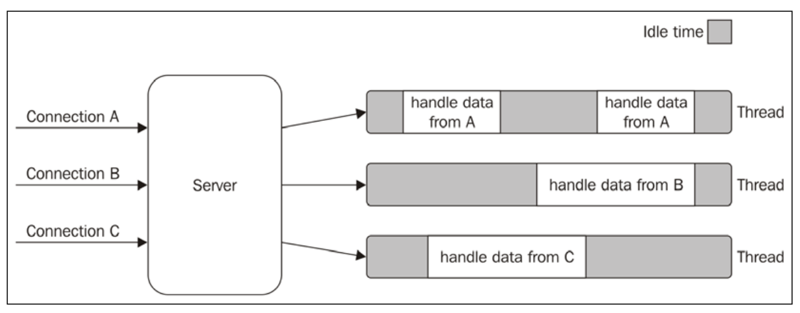
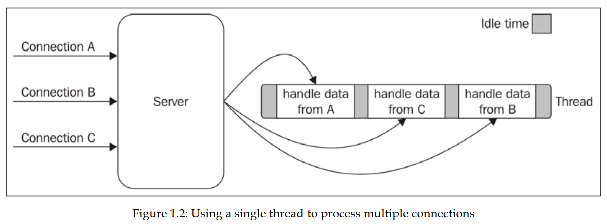

+ I/O (Input/Output) - это операции ввода/вывода. Выполняются очень медленно. Примеры таких операций: считывание файла с диска, доступ к интернет ресурсу и т.д. Операции доступа к RAM (оперативной памяти) требуют 10E-9 секунд, в то время как I/O операции требуют 10E-3 секунд
+ Обычно I/O операции являются блокирующими. Т.е во время выполнения такой операции не может выполняться что-то другое. Однако, существуют системы, которые могут обрабатывать эти операции без блокировки
# Blocking I/O

+ В обычных программах I/O операции блокирующие. Чтобы сервер мог обслуживать несколько клиентов приходиться зайдествовать несколько потоков или процессов



+ Минусы многопоточности:
	+ Каждый поток расходует память
	+ Переключение между потоками (context switching) расходует CPU и память
	+ В каждом потоке есть время простя *idle time*, когда поток ничего не делает
	+ Сложность разработки (race conditions, deadlocks, потоковое голодание)
	+ Сложность масштабирования
	+ Проблемы с безопасностью (т.к данные между потоками шарятся)
	+ Еще очень много минусов

# Non-blocking I/O

+ Существуют системы, поддерживающие неблокирующий I/O. При вызове блокирующих операций они сразу же возвращают управление. Ниже представлены подходы работы с неблокирующим I/O
## Busy-Waiting

+ Самый просто пример взаимодействия с неблокирующим I/O - паттерн *busy-waiting*. Он позволяет обрабатывать множество I/O в одном потоке. Он следит за состояниями ресурсов. Если какой-то ресурс готов, то он считывает информацию. 

```javascript
const resources = [socketA, socketB, fileA]

while (resources.length) {
	for (resource of resources) {
		const data = resource.read()
		if (data === NO_DATA_AVAILABLE) {
			continue
		}
		if (data === RESOURCE_CLOSED) {
			// remove resource from resources
		}
		consumeData(data) // data is ready
	}
}
```

+ Однако такой подход в пустую расходует CPU, выполняя постоянные итерации
## Event demultiplexing 

+ Этот подход предоставляет механизм подписки на события завершения I/O операций. 
+ Мы добавляем ресурсы для наблюдения. Далее мы *синхронно* (то есть выполнение блокируется до появления результатов) ждем результатов от какого-либо ресурса. Как только результаты появляются, мы обрабатываем их. 

```javascript
watchedList.add(socketA)
watchedList.add(socketB)

while (events = demultiplexer.watch(watchedList)) {
	for (event of events) {
		const data = event.read() // здесь уже нет блокировки
		consumeData(data)
	}
}
```
___
+ Схема работы сервера, использующего event demultiplexer



+ Как видно, такой способ позволяет обрабатывать множество соединений в одном потоке. Это экономит память и уменьшает время простоя *idle time*

## Reactor pattern

+ Reactor pattern - это сердце Node.js. Он использует *event demultiplexer*, но также предоставляет обработчик (handler) для каждой I/O операции. 


1. Приложение создает новую I/O операцию и передает ее в *Event Demultiplexer*. Также приложение передает handler, который будет вызван после выполнения операции. Добавление новой I/O операции не блокирует выполнение. 
2. Когда какая-либо I/O операция выполнена, *Event Demultiplexer* передает это событие в *Event Queue*
3. *Event Loop* итерируется по объектам в *Event Queue*
4. Для каждого события вызывается его handler
5. Выполняется код из handler. Когда его выполнение завершается, то управление передается обратно в *Event Loop* (5a). Во время выполнения код из handler может создать новую I/O операцию (5b), что приведет ее добавление в *Event Demultiplexer*. 
6. Когда все объекты из *Event Queue* обработаны, *Event Loop* блокируется и ждет новых событий от *Event Demultiplexer* 

