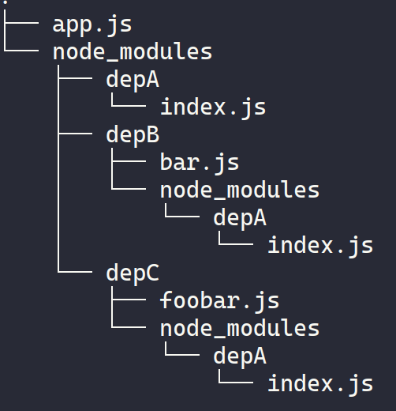

# Немного истории

+ В отличие от других платформ первоначально в JavaScript не было модульной системы
+ Когда впервые вышел в свет Node.js была создана модульная система **CommonJS**
+ В 2015 вышла спецификация **ECMA Script 6** (ECMA Script 2015), в которой содержалось описание (но не реализация!) новой модульной системы **ECMA Script modules** (ESM)
+ В Node 13.2 впервые удалось реализовать данную спецификацию **ESM**

# Паттерны

+ Существует множество паттернов для системы модулей
+ Самый простой паттерн - **Revialing Module Pattern** представлен в [файле](1-revealing-module-pattern.js)
+ Собственная реализация **CommonJS** модулей представлена в [файле](2-my-require.js) 

# CommonJS

## module.exports VS exports

При создании модуля создается объект:

```javascript
const module = {
  exports: {},
  ...
}
```

**exports** - это просто ссылка на **module.exports**

Если мы захотим переобъявить **exports**, то она перестанет ссылаться на объект **module**, что сделает ее использование бессмысленным

```javascript
exports = () => {} // уже не будет иметь смысла

module.exports = () => {} // но module.exports так может
```

## Require - синхронный

+ **require** работает синхронно. Это важно для того, чтобы модули загружались в объявленном порядке. Если бы они загружались асинхронно, то порядок был бы непредсказуем и из-за этого могли возникнуть ошибки
+ Ранее существовала асинхронная версия **require**, однако, она не используется из-за ее пере усложненности

## Resolving algorithm

Есть такое понятие как **dependency hell** - это когда в программе есть модули, которые зависят от одной библиотеки, но при этом в разных частях требуют разную версию этой зависимости. Node.js решает эту проблему, предоставляя
для каждой части свою версию зависимости. Например, модуля А будет предоставлена отдельная версия зависимости А, а модулю B также будет предоставлена отдельная версия зависимости для него.

Чтобы была возможность загружать разные версии зависимостей Node.js использует специальный алгоритм:
+ **File modules**: 
  + если имя модуля начинается с /, Node.js воспринимает это как абсолютный путь до файла и пытается загрузить модуль по этому пути
  + если имя модуля начинается с ./, Node.js воспринимает это как относительный путь и соединяет его с путем, где вызывается эта зависимость
+ **Core modules**:
  + если модуль не начинается с / или ./, Node.js пытается найти глобальный модуль с таким именем (например: **fs**, **path**, **http**)
+ **Package modules**:
  + если глобальный модуль не найден, Node.js начинает искать папку **node_modules**. Если в директории вызова модуля ее нет, то алгоритм поднимается на директории выше и продолжает поиски. Алгоритм продолжается, пока не дойдет до корневой директории.



Выше представлен пример зависимостей в проекте. У нас есть 3 зависимости: **depA**, **depB**, **depC**.
**depB** и **depC** зависят от **depA**, но для каждой этой зависимости есть своя копия **depA**, во избежание
**dependency hell** 

+ Вызов `require('debA')` в `app.js` загрузит зависимость из `node_modules/debA`
+ Вызов `require('debA')` в `node/modules/depB` загрузит зависимость из `node_modules/debB/node_modules/debA`
+ Вызов `require('debA')` в `node/modules/depC` загрузит зависимость из `node_modules/debC/node_modules/debA`

Благодаря алгоритму разрешения зависимостей, модули получат свои собственные версии зависимостей!